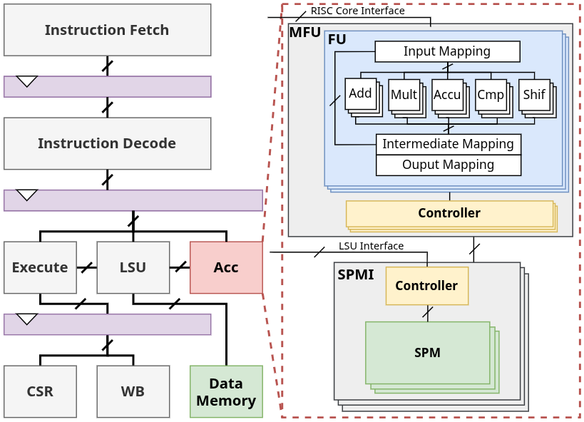

# Klessydra-T reliability assessment

## Klessydra-T
Klessydra-T is a highly configurable vector processor unit (VPU) integrated in an Interleaved-Multithreading RISC-V core. For more information, please visit the [pulpino-klessydra](https://github.com/gvilardefarias/pulpino-klessydra) repository.
### Architecture
Klessydra-T is divided into a custom Multi-Functional Unit (MFU) and a configurable scratchpad memory interface (SPMI).
The MFU is responsible for performing the integer operations with a configurable number of Functional Units (FUs).
The FUs available in the VPU are: multiplier (MULT), adder (ADD), accumulator (ACCU), comparator (CMP), and shifter (SHIF).
On the other hand, the SPMI is responsible for communicating with the scratchpad memory to provide the vector operands and store the results.



## Test
In `sw`, you can find all the programs and tests for Klessydra-T, along with instructions for compiling and simulating them.
### Permanent Faults
For permanent faults, the test is based on the execution of two AI core algorithms (matrix multiplication and convolution) and some Ad Hoc routines.

In `sw/apps/klessydra_tests/fault_tests/`:
- `test_1accl`:
Test for the VPU when only one instance of the accelerator is present
- `test_maccl`:
Test for the VPU when more than one instance of the accelerator is present
- `data`:
Scripts to generate the input data for the test
### Stress
For stress testing, the test is based on the execution of carefully crafted patterns, resorting to RTL heuristics and formal analysis methods.

In `sw/apps/klessydra_tests/toggle_tests/`:
- `stress`:
Stress program targeting the multiplier
- `data`:
Scripts to generate the input data for the test

## Publications
If you want to use this work, you can cite us:

```bibtex
@INPROCEEDINGS{Kless_STL,
  author={Vilar de Farias, Gustavo and Condia, Rodriguez Josie E. and Sonza Reorda, Matteo},
  booktitle={2026 IEEE 44th VLSI Test Symposium (VTS)}, 
  title={A Flexible Framework for Vector Accelerators In-field Testing}, 
  year={2026},
  volume={},
  number={},
  pages={1-7},
  keywords={Testing;Graphics processing units;Timing;Vectors;Printing;Codes;Hardware;Measurement units;High performance computing;Design methodology;Edge AI;Functional testing;Tensor operations;Vector accelerators;Software-Based Self-Test;Reliability},
  doi={10.1109/VTS69484.2026.11563325}}
```